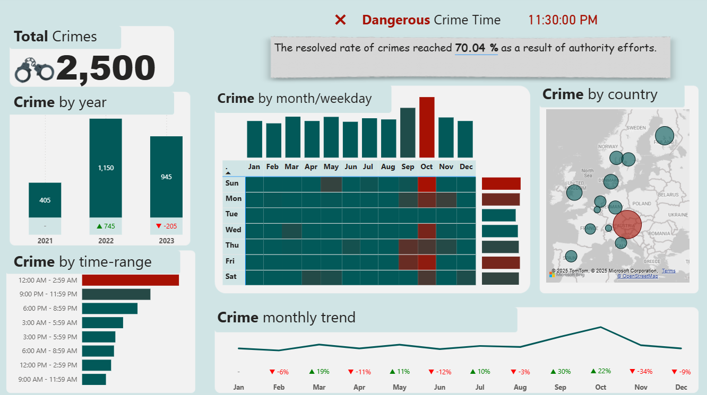
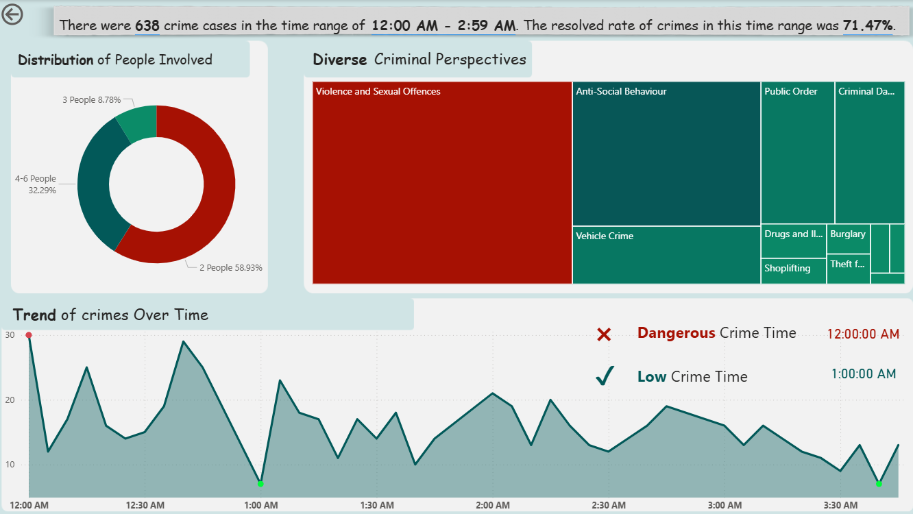

[Power BI] Crime Analytics Dashboard

An interactive analytics dashboard built with **Power BI**, providing insights into crime patterns across time, geography, and categories.  
This project includes 2 pages: an overview dashboard and a detailed drill-through analysis.

---

## 🖼️ Dashboard Screenshots

### **Overview Page**

### **Detail Drill-Through Page**

---

## Technologies Used
- **Power BI Desktop**
- **DAX Measures** for dynamic text, alerts, and KPIs
- **Drill-through Filtering**
- **Data Modeling** with Fact/Dimension structure

---

## Features

### Page 1 — Overview Dashboard
- **Total Crimes KPI**
- **Crime by Years** (column chart)
- **Crime by Time Range** (bar chart)
- **Crime by Month & Weekday** (heatmap)
- **Crime by Country** (map visualization)
- **Monthly Crime Trendline**
- **Dynamic Indicators**:
  - 🔴 Dangerous Crime Time  
  - 🟢 Low Crime Time
- **Resolved Crime Rate Message** (auto-calculated)

---

### 🔹 Page 2 — Drill-Through Analysis
When a user clicks a time range from page 1:

- **People Involved Distribution** (donut chart)
- **Crime Type Breakdown** (treemap)
- **Minute-by-minute Crime Trend** (line chart)
- **Dynamic Alerts** (dangerous & low crime time)
- **Auto-updating summary text**  
  Example:  
  *“There were X crimes from 12:00 AM – 2:59 AM. Resolved rate was Y%.”*

---

## Insights Provided
- Identify **high-risk time ranges**
- Observe **monthly and yearly crime trends**
- Understand **crime type distributions**
- Analyze **geographical hotspots**
- Support **police resource allocation & safety analytics**

## ✨ Author
**Hân / Chloe Nguyen**  
Data Analyst – Power BI | Python | SQL  

---
